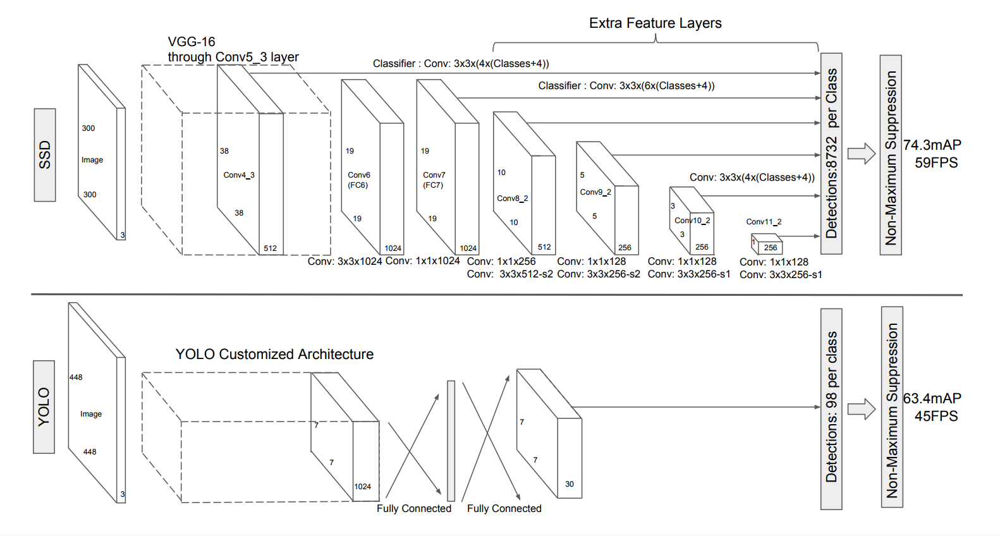
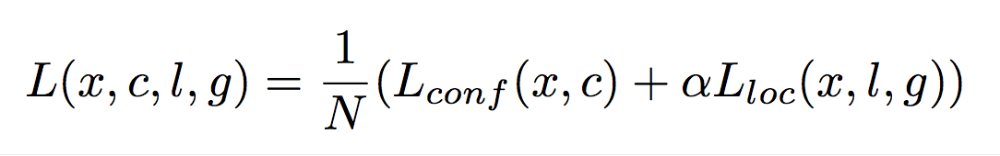

# Single Shot MultiBox Detector implemented by Keras

[github/wikke](https://github.com/wikke)

## Introduction

SSD(Single Shot MultiBox Detector) is a state-of-art object detection algorithm, brought by Wei Liu and other wonderful guys, see [SSD: Single Shot MultiBox Detector @ arxiv](https://arxiv.org/abs/1512.02325), recommended to read for better understanding.

Also, SSD currently performs good at PASCAL VOC Challenge, see [http://host.robots.ox.ac.uk:8080/leaderboard/displaylb.php?challengeid=11&compid=3](http://host.robots.ox.ac.uk:8080/leaderboard/displaylb.php?challengeid=11&compid=3)

## References

My work is just playing with this fantastic algorithm, and see the detection result of my own. Many many thanks goes to [rykov8/ssd_keras](https://github.com/rykov8/ssd_keras), which is an excellent implementation. [cory8249/ssd_keras](https://github.com/cory8249/ssd_keras) pulled an request, which makes it works with Keras 2 version, saves me a lot of time. **Core implementation code comes from [rykov8/ssd_keras](https://github.com/rykov8/ssd_keras)**

Additionally, I would like to **make the project more simple and clear for understanding**. Yes, it takes me time to figure out the mainline. So a little re-construction is done, leaving the function name same for the sake of easy comparison with original repo.

## Guides

The code structures looks like below:

```
- SSD.ipynb # Main code
- generator.py  # customrized generator, which return proper training data structure
				# including image and assigned boxes(similar to input boxex)
- get_data_from_XML.py # parse Annotations of PASCAL VOC, helper of generator
- VOCdevkit # dataset downloaded from [http://host.robots.ox.ac.uk/pascal/VOC/, use The VOC2007 Challenge in this example

- SSD300 # SSD 300 model lib
	- ssd_v2.py # main model
	- ssd_layers.py # Normalize and PriorBox defenition
	- ssd_training.py # MultiboxLoss Definition
	- ssd_utils.py # Utilities including encode,decode,assign_boxes
	- prior_boxes_ssd300.pkl # my understanding is the model pre-defined static prior boxes
```

## SSD

### network structure



### Loss function/ Training Objectives



## Resources

After hours of training on [Aliyun-GN4-instance](https://www.aliyun.com/product/ecs/gpu) with Nvidia M40 GPU, I got result with **multiple object categorical loss** 3.3392 at 16th epoch. Weights can be downloaded at [https://drive.google.com/file/d/0B5o_TPhUdyJWWEl5WG1lcUxCZzQ/view?usp=sharing](https://drive.google.com/file/d/0B5o_TPhUdyJWWEl5WG1lcUxCZzQ/view?usp=sharing)
